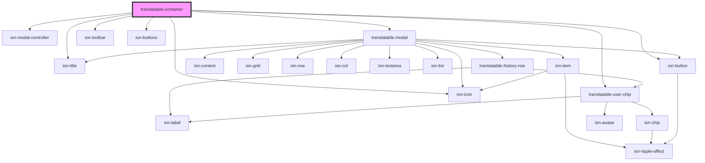

# translatable-container

<!-- Auto Generated Below -->

## Properties

| Property                 | Attribute              | Description | Type                  | Default     |
| ------------------------ | ---------------------- | ----------- | --------------------- | ----------- |
| `firebaseConfigPath`     | `firebase-config-path` |             | `string \| undefined` | `undefined` |
| `pageTitle` _(required)_ | `page-title`           |             | `string`              | `undefined` |

## Dependencies

### Depends on

- ion-modal-controller
- [translatable-modal](../translatable-modal)
- ion-toolbar
- ion-title
- [translatable-user-chip](../translatable-user-chip)
- ion-buttons
- ion-button
- ion-icon

### Graph

----------------------------------------------

*Built with [StencilJS](https://stenciljs.com/)*
