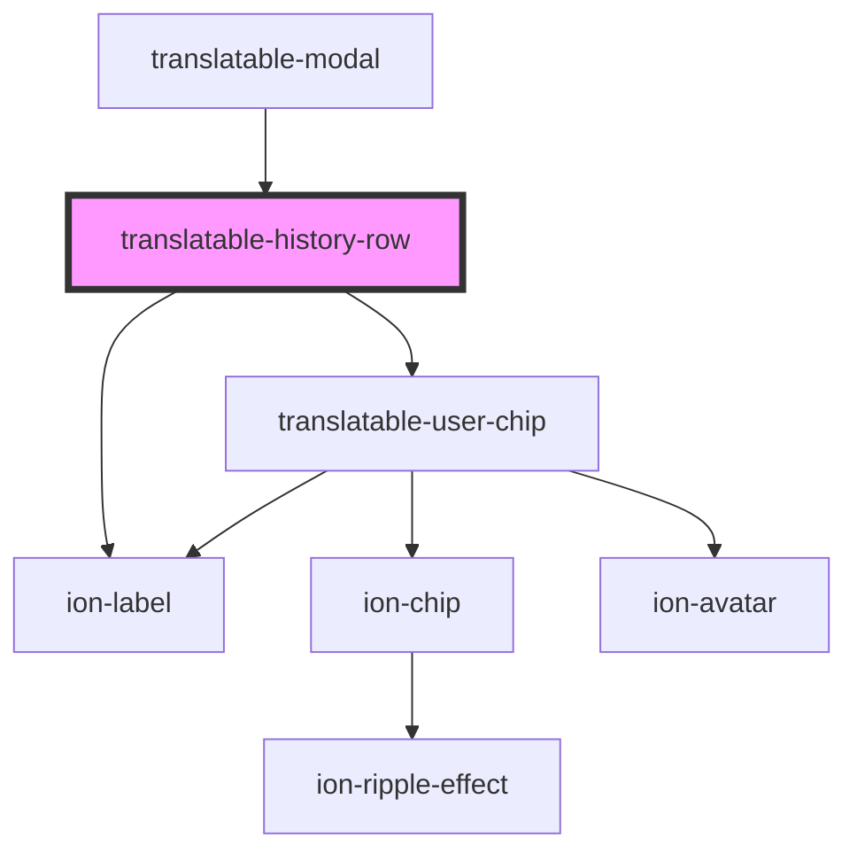

# translatable-history-row

<!-- Auto Generated Below -->

## Properties

| Property               | Attribute | Description | Type               | Default     |
| ---------------------- | --------- | ----------- | ------------------ | ----------- |
| `history` _(required)_ | --        |             | `TranslateHistory` | `undefined` |

## Dependencies

### Used by

 - [translatable-modal](../translatable-modal)

### Depends on

- ion-label
- [translatable-user-chip](../translatable-user-chip)

### Graph

----------------------------------------------

*Built with [StencilJS](https://stenciljs.com/)*
