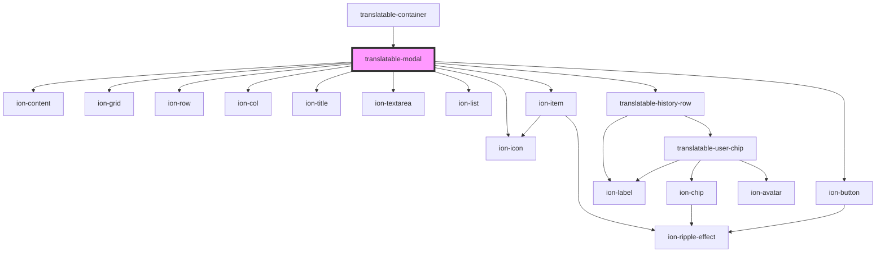

# translatable-modal

<!-- Auto Generated Below -->

## Properties

| Property                      | Attribute           | Description | Type                 | Default     |
| ----------------------------- | ------------------- | ----------- | -------------------- | ----------- |
| `history`                     | --                  |             | `TranslateHistory[]` | `[]`        |
| `isUserSignedIn`              | `is-user-signed-in` |             | `boolean`            | `false`     |
| `originalText` _(required)_   | `original-text`     |             | `string`             | `undefined` |
| `translatedText` _(required)_ | `translated-text`   |             | `string`             | `undefined` |

## Events

| Event             | Description | Type                                |
| ----------------- | ----------- | ----------------------------------- |
| `cancel`          |             | `CustomEvent<void>`                 |
| `requireSignIn`   |             | `CustomEvent<RequireSignInEvent>`   |
| `saveTranslation` |             | `CustomEvent<SaveTranslationEvent>` |

## Dependencies

### Used by

 - [translatable-container](../translatable-container)

### Depends on

- ion-content
- ion-grid
- ion-row
- ion-col
- ion-title
- ion-textarea
- ion-list
- ion-item
- [translatable-history-row](../translatable-history-row)
- ion-button
- ion-icon

### Graph

----------------------------------------------

*Built with [StencilJS](https://stenciljs.com/)*
