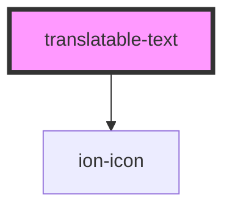

# my-component

<!-- Auto Generated Below -->

## Properties

| Property                    | Attribute         | Description | Type                  | Default     |
| --------------------------- | ----------------- | ----------- | --------------------- | ----------- |
| `file` _(required)_         | `file`            |             | `string`              | `undefined` |
| `hash` _(required)_         | `hash`            |             | `string`              | `undefined` |
| `originalText` _(required)_ | `original-text`   |             | `string`              | `undefined` |
| `preparing`                 | `preparing`       |             | `boolean`             | `true`      |
| `translatedText`            | `translated-text` |             | `string \| undefined` | `undefined` |

## Events

| Event              | Description | Type                                 |
| ------------------ | ----------- | ------------------------------------ |
| `fetchTranslation` |             | `CustomEvent<FetchTranslationEvent>` |
| `startTranslation` |             | `CustomEvent<StartTranslationEvent>` |

## Methods

### `setPhrase(phrase: PhraseData | null) => Promise<void>`

#### Returns

Type: `Promise<void>`

## Dependencies

### Depends on

- ion-icon

### Graph

----------------------------------------------

*Built with [StencilJS](https://stenciljs.com/)*
