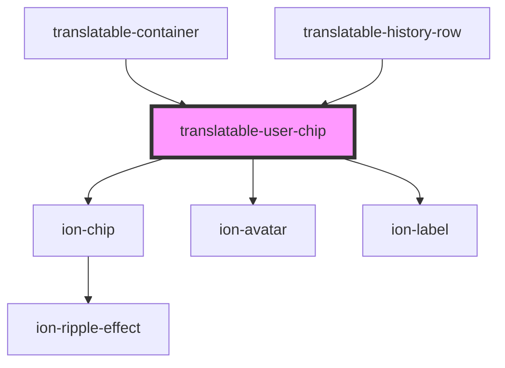

# translatable-user-chip

<!-- Auto Generated Below -->

## Properties

| Property      | Attribute      | Description | Type                  | Default     |
| ------------- | -------------- | ----------- | --------------------- | ----------- |
| `color`       | `color`        |             | `string \| undefined` | `undefined` |
| `displayName` | `display-name` |             | `string \| undefined` | `undefined` |
| `photoURL`    | `photo-u-r-l`  |             | `string \| undefined` | `undefined` |
| `textColor`   | `text-color`   |             | `string \| undefined` | `undefined` |

## Dependencies

### Used by

 - [translatable-container](../translatable-container)
 - [translatable-history-row](../translatable-history-row)

### Depends on

- ion-chip
- ion-avatar
- ion-label

### Graph

----------------------------------------------

*Built with [StencilJS](https://stenciljs.com/)*
